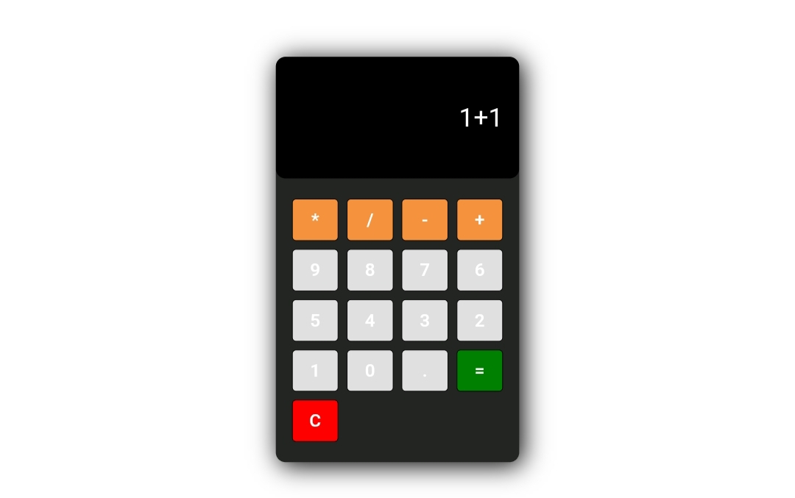

# 🧮 Calculator

A simple and responsive calculator built using **HTML**, **CSS**, and **JavaScript**.  
It supports basic arithmetic operations like addition, subtraction, multiplication, and division.

---

## 📸 Screenshot

<div align="center">
  
</div>

---

## 🚀 Features
- Clean and responsive design  
- Supports basic arithmetic operations (+, -, ×, ÷)  
- Interactive buttons with hover effects  
- Real-time calculation display  
- Easy to use and lightweight  

---

## 🛠️ Technologies Used
- **HTML5**  
- **CSS3**  
- **JavaScript (Vanilla JS)**  

---

## 📂 Project Structure
```
calculator/
│── index.html    # Main HTML structure
│── style.css     # Styling and layout
│── app.js        # Functionality and logic
```

## 📜 License
This project is open-source and available under the **MIT License**.
