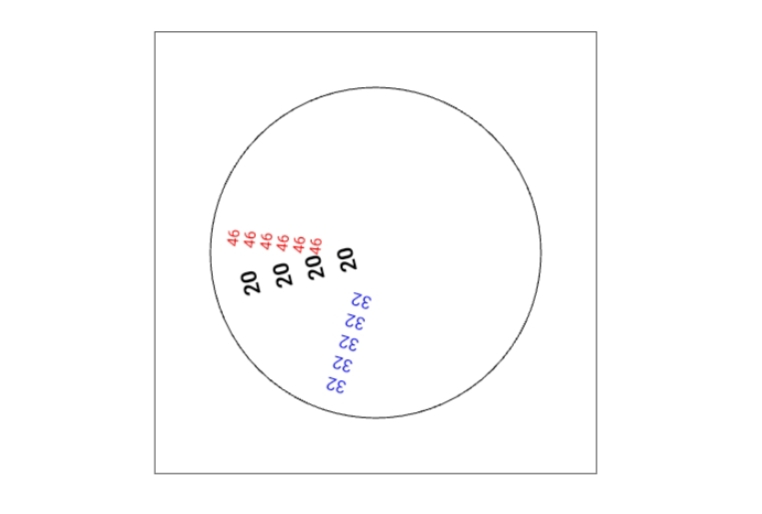

# Digilog Clock

A unique digital-analog hybrid clock implemented using HTML, CSS, and JavaScript. The clock displays hours, minutes, and seconds as numbers repeated radially around a canvas, creating a mesmerizing line-of-numbers effect. This creative clock combines functionality and aesthetics, making it a perfect addition to any web project.

## Features
- **Digital-Analog Fusion**: Displays time with numbers repeated radially around a canvas.
- **Dynamic Updates**: Real-time clock updates every second using JavaScript.
- **Customizable Appearance**: Adjustable styles for hours, minutes, and seconds.
- **Canvas-based Design**: Fully drawn on an HTML `<canvas>` for lightweight performance.
- **Visually Appealing**: Eye-catching design suitable for creative and interactive web applications.

## Screenshot

  

## Download

`Click the link below and select "Save Link As..." to download the source code`

<a href="https://raw.githubusercontent.com/y-nabeelxd/Digilog-Clock/refs/heads/main/index.html">
  <button style="padding: 10px 20px; background-color: #4CAF50; color: white; border: none; border-radius: 5px; cursor: pointer;">
    Download
  </button>
</a> | <a href="https://y-nabeelxd.github.io/y-nabeelxd/Pvt-Files/Demo/Digilog-Clock">
  <button style="padding: 10px 20px; background-color: #4CAF50; color: white; border: none; border-radius: 5px; cursor: pointer;">
    Live Demo
  </button>
</a>

## About the Project
The **Digilog Clock** is a unique take on time representation, combining the structure of analog clocks with the precision of digital displays. Each hand (hours, minutes, and seconds) dynamically rotates and draws repeated numerical values along its path:
- **Hour Numbers**: Repeated in black, bold font, forming an outer ring.
- **Minute Numbers**: Repeated in blue, mid-sized font, placed within the hour numbers.
- **Second Numbers**: Repeated in red, smaller font, adding fine detail.

This project serves as a demonstration of JavaScript's capabilities in manipulating the HTML Canvas API for interactive and creative outputs.

---

Enjoy exploring and experimenting with the Digilog Clock!
