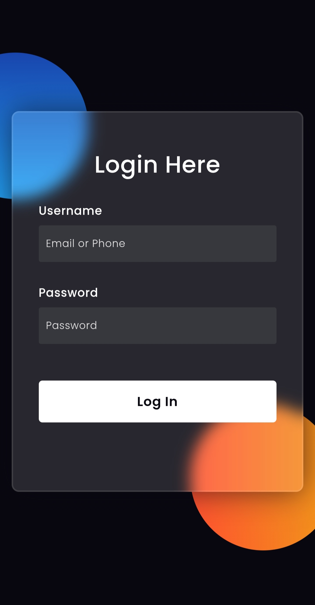
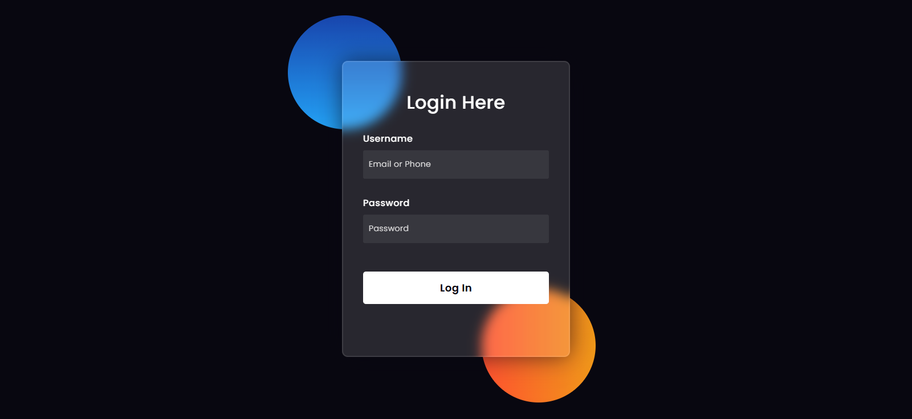

# Login Glassmorphism (Modified Version)

A modern login page designed with HTML and CSS, now enhanced with auto-scaling functionality to detect and adjust to different device sizes. This version offers a cleaner, more focused UI by removing social login buttons while maintaining the sleek and minimalistic glassmorphism effect.

## Features
- Glassmorphism design for a modern look.
- Simple and clean HTML structure.
- Auto-detects device size and automatically resizes the layout for a better user experience.
- Fully responsive CSS for different devices.

## Difference from the Previous Version
- Removed social login buttons for Google and Facebook to keep the UI clean.
- Added an auto-scaling feature that dynamically adjusts the form and background size based on the user's device resolution.

## Screenshot

  
Screenshots

   
  Mobile View

  

 
  Desktop View

  

## Download

`Click the link below and select "Save Link As..." to download the source code`

<a href="https://raw.githubusercontent.com/y-nabeelxd/Login-Glassmorphism-Modifyed/refs/heads/main/index.html">
  <button style="padding: 10px 20px; background-color: #4CAF50; color: white; border: none; border-radius: 5px; cursor: pointer;">
    Download
  </button>
</a> | <a href="https://y-nabeelxd.github.io/y-nabeelxd/Pvt-Files/Demo/Login-Glassmorphism-Modifyed">
  <button style="padding: 10px 20px; background-color: #4CAF50; color: white; border: none; border-radius: 5px; cursor: pointer;">
    Live Demo
  </button>
</a> | <a href="https://github.com/y-nabeelxd/Login-Glassmorphism">
  <button style="padding: 10px 20px; background-color: #4CAF50; color: white; border: none; border-radius: 5px; cursor: pointer;">
    Pervious Version
  </button>
</a>
