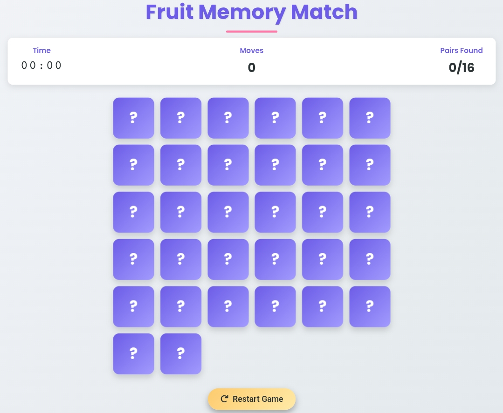

# 🍎 Fruit Memory Match Game

A fun and engaging memory matching game built with **HTML**, **CSS**, and **JavaScript**. Test your memory by matching pairs of delicious fruit emojis!

---

## 📸 Screenshot

  

---

## 🎮 Features

- **Beautiful UI** with smooth animations and transitions
- **Timer** to track your completion time
- **Move counter** to track your progress
- **16 fruit pairs** (32 cards) for optimal challenge
- **Responsive design** that works on all devices
- **Confetti celebration** when you win
- **Restart game** functionality
- **Randomized card positions** on each game start

---

## 🛠️ Technologies Used

- **HTML5** - Game structure and content
- **CSS3** - Styling, animations, and responsive design
- **JavaScript (Vanilla JS)** - Game logic and interactivity
- **Font Awesome** - For button icons
- **Google Fonts** - Poppins font family

---

## 🕹️ How to Play

1. Click on any card to reveal a fruit emoji
2. Click on another card to find its match
3. If the fruits match, they'll stay revealed
4. If they don't match, they'll flip back
5. Complete all 16 pairs in the fewest moves and fastest time!

---

## 📜 License

This project is open-source and available under the **MIT License**.
